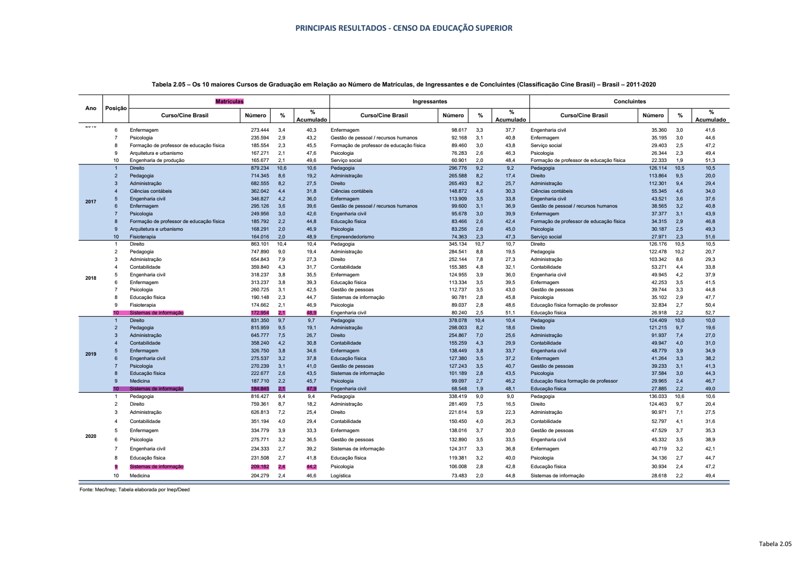
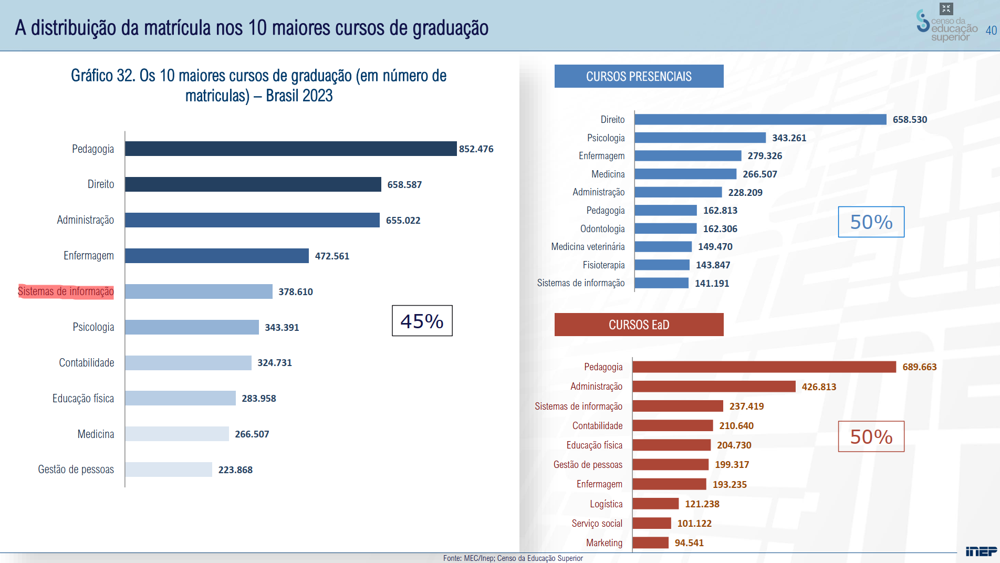

### Situação Atual

Todos os anos são investidos bilhões de reais na realização de concursos públicos para suprir a demanda de colaboradores dos governos federal, estadual e municipal. Em 2025, foram cerca de [R$ 4 Bilhões](https://g1.globo.com/trabalho-e-carreira/concursos/noticia/2024/11/28/governo-vai-cortar-r-1-bi-do-orcamento-para-novos-concursos-em-2025-enem-dos-concursos-segue-previsto-diz-ministra.ghtml) apenas para essa finalidade. Caso deseje um parâmetro para comparação, o orçamento para a Universidade Federal de Santa Catarina é de cerca de [R$ 2 Bilhões](http://so.seplan.ufsc.br/) para o ano de 2025. Tal montante é, majoritariamente, destinado a bancas examinadoras, as quais são encarregadas de todas as etapas do certame, desde as inscrições até a idealização das questões, bem como a fiscalização e aplicação das provas.

### O Problema da Atual Dinâmica de Concursos

Apesar de todo o dinheiro investido por parte do governo, o que é extremamente relevante para compor um quadro de colaboradores capacitados, não há uma iniciativa conjunta — isto é, entre todos os entes governamentais — para criar uma base de dados pública que vise agrupar as questões redigidas pelas bancas.

Assim, perde-se o dinheiro investido e a possibilidade de fornecer **gratuitamente** um material de estudo de altíssima qualidade, que foi financiado com o dinheiro de toda a população, para os próprios cidadãos que desejam ingressar no serviço público. O conhecimento produzido fica "preso" a cada certame individual, beneficiando apenas as empresas que o exploram comercialmente.

### Não há Impedimento Jurídico para tal Ação

A prova de que este conteúdo não possui restrições de uso é que, atualmente, um diversas empresas lucram valores expressivos catalogando exatamente essas questões de concursos públicos e vendendo o acesso a elas através de assinaturas. As principais são:

* Estratégia Concursos
* Gran Cursos Online (Gran Questões)
* Tec Concursos
* Qconcursos
* Direção Concursos

Se empresas privadas podem **licitamente compilar e lucrar** com este material de domínio público, nada impede que uma iniciativa comunitária e sem fins lucrativos faça o mesmo em benefício de todos. É exatamente essa lacuna que o **CompCon** se propõe a preencher.

### O foco em Tecnologia da Informação

É inegável que disputar espaço com essas empresas, principalmente em todo o nicho de mercado que elas abarcam, seria impraticável - ***provavelmente a ideia morreria antes mesmo de que alguma pessoa soubesse que ela existiu***. Assim, a abordagem tomado pelo projeto foi a de "atacar" um nicho específico de mercado dessas empresas: Tecnologia da Informação. 

Atualmente, essa é uma área pouco desenvolvida nas empresas de concursos, tendo em vista que grande parte dos desenvolvedores de softwares recém formados almeja como trabalho dos sonhos uma posição em uma multinacional instalada no Brasil ou até mesmo uma oportunidade em uma Bigtech. 

Dessa forma, não há tanta demanda para produzir resoluções de questões, bem como matérias com o mesmo nível de profundidade de outras áreas - pode-se citar, como exemplo, a preparação para concursos de tribunais e fiscos, áreas mais bem pagas da carreira pública. Ainda assim, há uma crescente demanda por conteúdo de Tecnologia da Informação direcionado para concursos públicos.

### Qual a tendência para o futuro?

Em 2020, com a mudança repentina causada pelo *lockdown*, uma demanda crescente de profissionais de TI foi exigida para suprir as necessidades das empresas que tiveram de migrar para o digital. No dias atuais, esse fenômeno gerou um excedente de profissionais e uma grande dificuldade de ingresso em posições juniores. Veja a seguir uma pesquisa mostrando o crescimento da graduação em **Sistemas de Informação**:

Fonte: [Censo Educação Superior 2020 - INEP](https://download.inep.gov.br/educacao_superior/censo_superior/documentos/2020/tabelas_de_divulgacao_censo_da_educacao_superior_2020.pdf)

Fonte: [Censo Educação Superior 2023 - INEP](https://download.inep.gov.br/educacao_superior/censo_superior/documentos/2023/apresentacao_censo_da_educacao_superior_2023.pdf)

Perceba que houve um salto de 5 posições (10º para 5º) entre os anos de 2018 até 2023. Tal fato ressalta um forte indicativo de crescimento de interesse na área.

### Realidade atual do mercado e chegada da IA

Este cenário de crescente interesse pela área de TI, evidenciado pelo aumento no número de graduados, colide com uma realidade de mercado cada vez mais desafiadora para iniciantes. A alta demanda por profissionais durante a pandemia gerou um "boom" que, agora, se reflete em um mercado mais saturado para posições juniores e uma maior exigência por parte das empresas.

Adicionalmente, a rápida evolução e adoção de **Inteligência Artificial (IA)** generativa começa a impactar as funções de entrada no mercado de desenvolvimento. Tarefas que antes eram delegadas a juniores, como a criação de *boilerplate code*, testes unitários básicos ou mesmo a depuração inicial, podem ser cada vez mais auxiliadas ou até mesmo automatizadas por IAs. Isso eleva a barra para os novos profissionais, que precisam demonstrar habilidades mais complexas desde o início de suas carreiras.

### O Serviço Público como Alternativa Atraente

Nesse contexto, o **setor público** emerge como uma alternativa cada vez mais atraente para os profissionais de TI, oferecendo:

1.  **Estabilidade:** Em contraste com a volatilidade do mercado privado, especialmente em *startups* e *empresas de tecnologia tradicionais*.
2.  **Remuneração Competitiva:** Muitos cargos de TI no setor público oferecem salários iniciais e progressão de carreira interessantes.
3.  **Menor Impacto (inicial) da IA:** Embora a IA vá transformar o serviço público a longo prazo, a adoção tende a ser mais gradual, e as avaliações em concursos ainda se baseiam fortemente no conhecimento teórico e prático tradicional.
4.  **Demanda Constante:** A digitalização dos serviços públicos é um caminho sem volta, garantindo uma demanda contínua por profissionais de TI qualificados.

### O Papel do CompCon 

É neste cenário de mercado desafiador para juniores, ascensão da IA e crescente atratividade do serviço público que o **CompCon** se insere. Ao fornecer uma **plataforma gratuita, open-source e focada em TI**, o projeto visa:

* **Democratizar o acesso:** Permitir que todos os profissionais de TI, independentemente da sua condição financeira, possam se preparar adequadamente para concursos públicos.
* **Elevar o nível técnico:** Criar uma comunidade onde o conhecimento é compartilhado, as questões são discutidas e resolvidas colaborativamente, contribuindo para a formação de servidores públicos mais qualificados.
* **Ser um porto seguro:** Oferecer um recurso confiável e em constante atualização para aqueles que buscam a estabilidade e as oportunidades da carreira pública em TI.

O CompCon não é apenas um banco de questões, mas uma iniciativa para fortalecer a comunidade de TI e facilitar o acesso a carreiras públicas de qualidade, num momento em que essas oportunidades se tornam cada vez mais relevantes.

### Além da Área Pública: Um Recurso Educacional 

O valor das questões de concursos públicos de TI transcende a mera preparação para o serviço público. Elas representam um acervo riquíssimo e **gratuito** para iniciativas educacionais e para o autoaperfeiçoamento de qualquer estudante ou profissional da área, especialmente no **refinamento de conceitos teóricos**.

A estrutura de ensino predominante em universidades e cursos técnicos segue um modelo bem estabelecido: **Teoria -> Exercícios -> Prova/Avaliação**. Nesse modelo, as avaliações (provas) não são apenas um método de aferição, mas uma ferramenta crucial para **consolidar o aprendizado**, forçando o aluno a aplicar a teoria em cenários concretos e a identificar lacunas no seu entendimento.

As questões de concursos públicos funcionam exatamente como essa etapa final de avaliação e consolidação, mas com algumas vantagens adicionais:

1.  **Qualidade e Curadoria:** São elaboradas por bancas especializadas, geralmente com um alto rigor técnico, abordando os fundamentos e as nuances dos conceitos de TI.
2.  **Relevância Prática:** Muitas questões, embora teóricas, são baseadas em cenários ou problemas encontrados no dia a dia da profissão.
3.  **Custo Zero:** Diferente de livros didáticos caros ou plataformas de ensino pagas, este é um recurso de alta qualidade disponível publicamente.
4.  **Padronização:** Permitem que estudantes de diferentes instituições se avaliem usando uma régua comum e alinhada com as exigências do mercado (incluindo o público).

Dessa forma, o **CompCon**, ao organizar e disponibilizar gratuitamente essas questões, não serve apenas aos concurseiros, mas também a:

* **Estudantes universitários:** Que podem usar a plataforma para testar e aprofundar o conhecimento adquirido em disciplinas como Estrutura de Dados, Redes de Computadores, Engenharia de Software, Bancos de Dados, etc.
* **Professores e Instituições de Ensino:** Que podem utilizar o acervo para criar listas de exercícios, simulados ou até mesmo como base para avaliações, sem custo algum.
* **Profissionais em transição de carreira ou buscando atualização:** Que encontram um meio prático e direto para revisar conceitos fundamentais.

O CompCon, portanto, também se posiciona como uma ferramenta de apoio à educação formal e informal em Tecnologia da Informação, aproveitando um recurso público de grande valor pedagógico que hoje é subutilizado nesse contexto.
